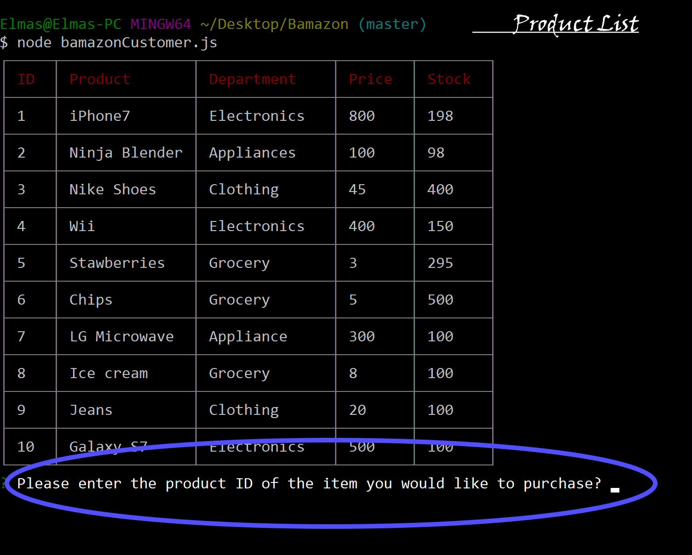
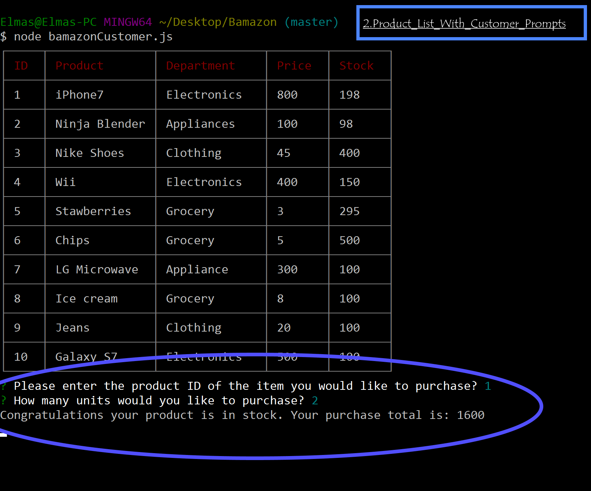
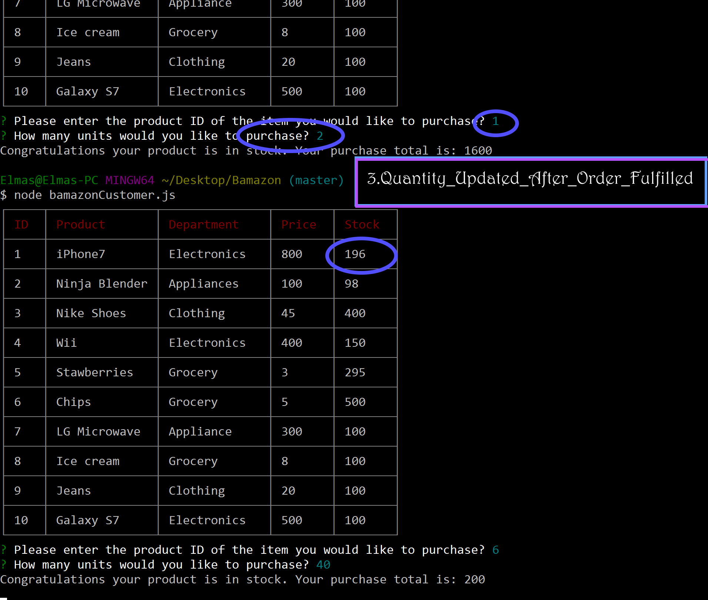
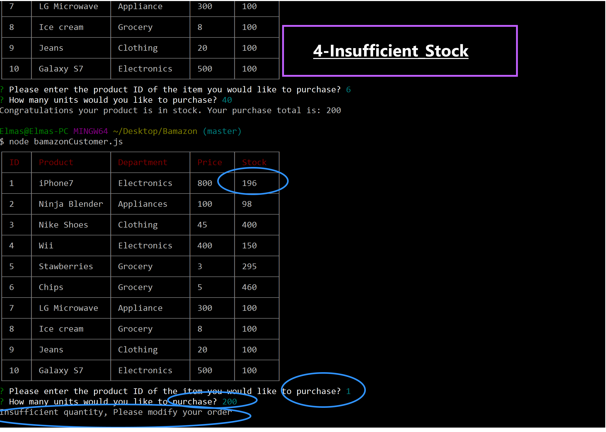
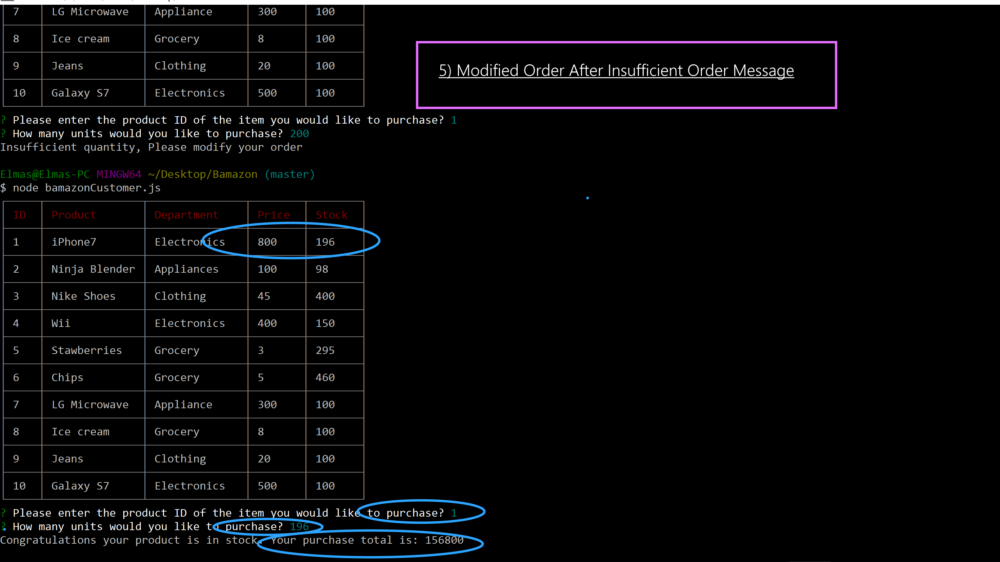
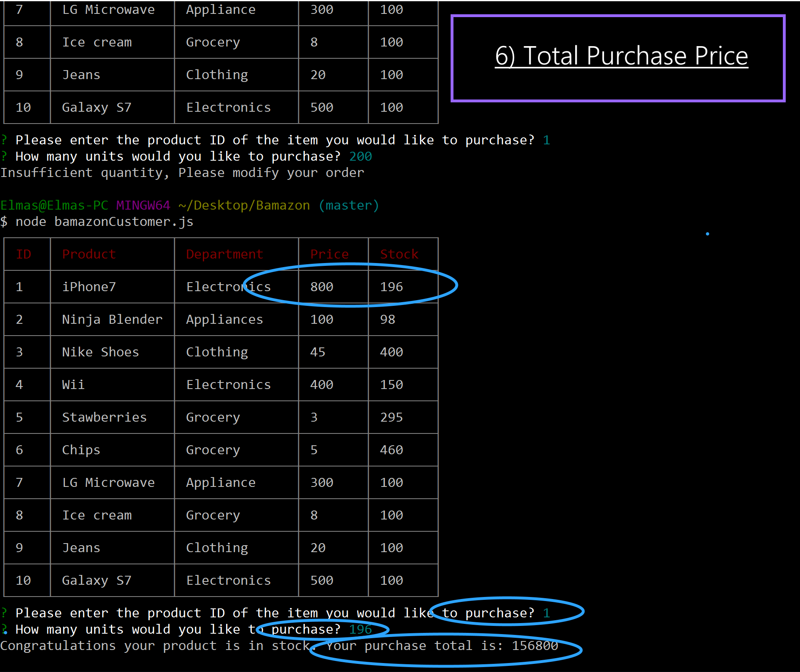
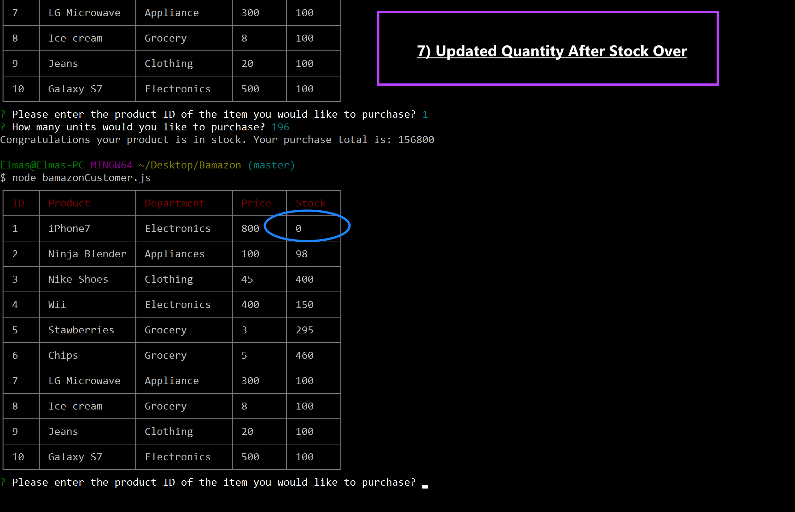

# Bamazon

1) Product List

  

2) Product List With Customer Prompts

3) Quantity Updated After Order Fulfilled

4) Insufficient Stock

5) Modified Order After Insufficient Order Message

6) Total purchase price

7) Updated Quantity After Stock Over

